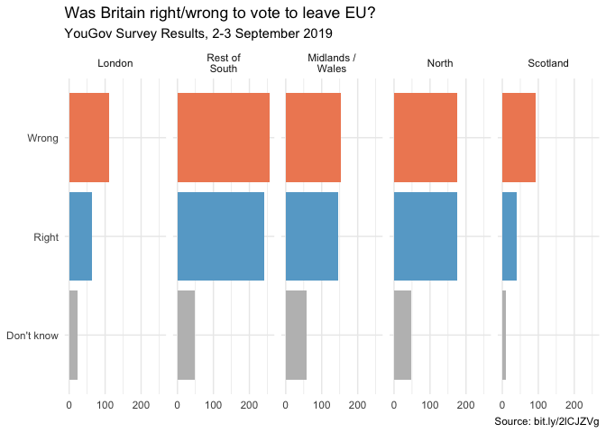
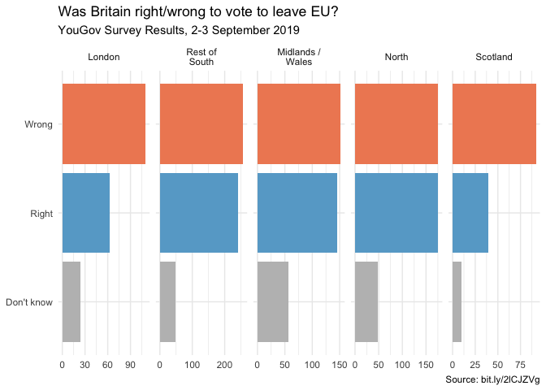
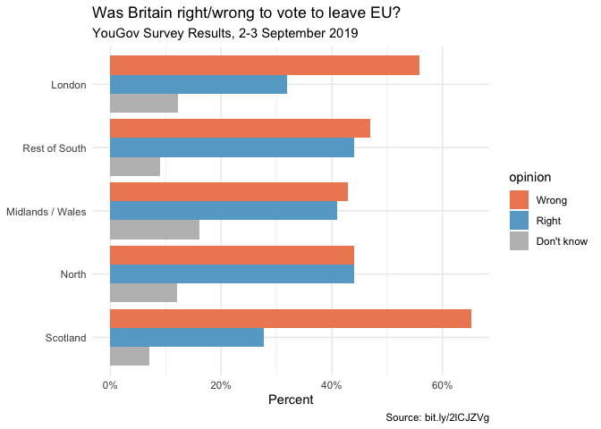

Brexit
================
Cami Ciesielski

In September 2019, YouGov survey asked 1,639 GB adults the following
question:

> In hindsight, do you think Britain was right/wrong to vote to leave
> EU?
>
> -   Right to leave  
> -   Wrong to leave  
> -   Don’t know

The data from the survey is in `data/brexit.csv`.

``` r
brexit <- read_csv("data/brexit.csv")
```

In class we made the following visualization.

``` r
brexit <- brexit %>%
  mutate(
    region = fct_relevel(region, "london", "rest_of_south", "midlands_wales", "north", "scot"),
    region = fct_recode(region, London = "london", `Rest of South` = "rest_of_south", `Midlands / Wales` = "midlands_wales", North = "north", Scotland = "scot")
  )

ggplot(brexit, aes(y = opinion, fill = opinion)) +
  geom_bar() +
  facet_wrap(~region, nrow = 1, labeller = label_wrap_gen(width = 12)) +
  guides(fill = FALSE) +
  labs(
    title = "Was Britain right/wrong to vote to leave EU?",
    subtitle = "YouGov Survey Results, 2-3 September 2019",
    caption = "Source: bit.ly/2lCJZVg",
    x = NULL, y = NULL
  ) +
  scale_fill_manual(values = c(
    "Wrong" = "#ef8a62",
    "Right" = "#67a9cf",
    "Don't know" = "gray"
  )) +
  theme_minimal()
```

    ## Warning: `guides(<scale> = FALSE)` is deprecated. Please use `guides(<scale> =
    ## "none")` instead.

<!-- -->

In this application exercise we tell different stories with the same
data.

### Exercise 1 - Free scales

Add `scales = "free_x"` as an argument to the `facet_wrap()` function.
How does the visualization change? How is the story this visualization
telling different than the story the original plot tells?

``` r
ggplot(brexit, aes(y = opinion, fill = opinion)) +
  geom_bar() +
  facet_wrap(~region,
    nrow = 1, labeller = label_wrap_gen(width = 12),
    scales = "free_x"
  ) +
  guides(fill = FALSE) +
  labs(
    title = "Was Britain right/wrong to vote to leave EU?",
    subtitle = "YouGov Survey Results, 2-3 September 2019",
    caption = "Source: bit.ly/2lCJZVg",
    x = NULL, y = NULL
  ) +
  scale_fill_manual(values = c(
    "Wrong" = "#ef8a62",
    "Right" = "#67a9cf",
    "Don't know" = "gray"
  )) +
  theme_minimal()
```

    ## Warning: `guides(<scale> = FALSE)` is deprecated. Please use `guides(<scale> =
    ## "none")` instead.

<!-- -->

### Exercise 2 - Comparing proportions across facets

First, calculate the proportion of wrong, right, and don’t know answers
in each category and then plot these proportions (rather than the
counts) and then improve axis labeling. How is the story this
visualisation telling different than the story the original plot tells?
**Hint:** You’ll need the **scales** package to improve axis labeling,
which means you’ll need to load it on top of the document as well.

``` r
 brexit %>% 
  count(region, opinion) %>% 
  group_by(region) %>% 
  mutate(opinion_prop = n / sum(n)) %>% 
ggplot(aes(x = opinion_prop, fill = opinion, y = opinion)) +
  geom_col() +
  guides(fill = FALSE) +
  facet_wrap(~region, nrow = 1, labeller = label_wrap_gen(width = 12)) + 
    labs(
    title = "Was Britain right/wrong to vote to leave EU?",
    subtitle = "YouGov Survey Results, 2-3 September 2019",
    caption = "Source: bit.ly/2lCJZVg",
    x = "Percent", y = NULL
  ) +
  scale_fill_manual(values = c(
    "Wrong" = "#ef8a62",
    "Right" = "#67a9cf",
    "Don't know" = "gray")) +
  theme_minimal() + 
  scale_x_continuous(labels = percent)
```

    ## Warning: `guides(<scale> = FALSE)` is deprecated. Please use `guides(<scale> =
    ## "none")` instead.

<!-- -->

### Exercise 3 - Comparing proportions across bars

``` r
 brexit %>% 
  count(region, opinion) %>% 
  group_by(region) %>% 
  mutate(opinion_prop = n / sum(n)) %>% 
ggplot(aes(x = opinion_prop, fill = opinion, y = fct_rev(region))) +
  geom_col(position = "dodge") +
  #facet_wrap(~region, nrow = 1, labeller = label_wrap_gen(width = 12)) + 
    labs(
    title = "Was Britain right/wrong to vote to leave EU?",
    subtitle = "YouGov Survey Results, 2-3 September 2019",
    caption = "Source: bit.ly/2lCJZVg",
    x = "Percent", y = NULL
  ) +
  scale_fill_manual(values = c(
    "Wrong" = "#ef8a62",
    "Right" = "#67a9cf",
    "Don't know" = "gray")) +
  theme_minimal() + 
  scale_x_continuous(labels = percent)
```

<!-- -->
